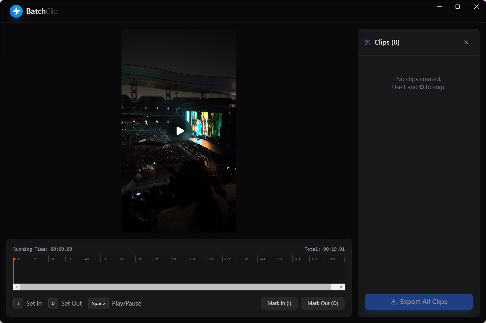

# BatchClip - 视频批量片段提取工具

我发现在手机上使用一些工具对视频进行裁切效率过低，于是开发了这款用于从视频中快速截取多个短片段的桌面应用。特别适合为 Live Photo 准备素材，或者快速筛选素材进行剪辑。



## ✨ 功能特点

- **多片段标记**: 在同一视频中标记任意数量的片段
- **快捷键操作**: 使用 `I` / `O` 键快速标记入点/出点
- **自定义时长**: 可以在设置中开启/关闭固定时长模式，并自定义默认时长
- **多语言支持**: 界面支持中英文即时切换
- **批量导出**: 一键导出所有片段为独立的 `.mov` 文件
- **实时预览**: 时间轴可视化已标记的所有片段

## 🚀 快速开始

### 环境要求
- Node.js 18+
- npm 或 pnpm

### 安装依赖
```bash
npm install
```

### 开发模式
```bash
npm run dev
```

### 构建发布版

#### Windows 版本（本地构建）
在 Windows 环境下构建 Windows 版本：

**方法1：普通构建（推荐）**
```bash
npm run build
# 或
npm run build:win
```

**方法2：如果遇到 winCodeSign 符号链接错误，请以管理员权限运行：**
1. 右键点击 PowerShell 或命令提示符
2. 选择"以管理员身份运行"
3. 导航到项目目录
4. 运行：`npm run build:win`

**方法3：使用 PowerShell 脚本（自动检测管理员权限）**
```bash
npm run build:win:ps1
```

构建产物位于 `release/{version}/` 目录下。

> **注意**：如果遇到 "Cannot create symbolic link" 错误，这是因为 winCodeSign 工具包包含 macOS 符号链接。解决方法是以管理员权限运行构建，或者使用上述 PowerShell 脚本。

#### macOS 版本（本地构建）
在 macOS 环境下构建：
```bash
npm run build:mac
```
构建产物同样位于 `release/` 目录下。

#### macOS 版本（使用 GitHub Actions）
由于 macOS 应用需要在 macOS 环境下构建，推荐使用 GitHub Actions：

1. 将代码推送到 GitHub 仓库
2. 创建并推送一个标签（例如 `v1.0.0`）：
   ```bash
   git tag v1.0.0
   git push origin v1.0.0
   ```
3. GitHub Actions 会自动触发构建
4. 在 GitHub Actions 页面下载构建产物

或者手动触发：
- 在 GitHub 仓库页面，进入 "Actions" 标签
- 选择 "Build Electron App" 工作流
- 点击 "Run workflow"

#### 构建所有平台
```bash
npm run build:all
```
注意：`build:all` 只能在对应平台上构建对应版本（Windows 上只能构建 Windows 版本）。

## 📖 使用方法

1. **导入视频**: 拖拽视频文件到应用窗口，或点击选择文件
2. **播放视频**: 按 `空格键` 播放/暂停
3. **偏好设置**: 点击侧边栏的齿轮图标，设置默认时长和语言
4. **标记片段**: 
   - 按 `I` 键标记片段起始点
   - 按 `O` 键标记片段结束点
   - 若开启了固定时长，达到设定时长后将自动闭合
5. **管理片段**: 在右侧列表查看和删除已标记的片段
6. **批量导出**: 点击「Export All Clips」选择输出文件夹

## ⌨️ 快捷键

| 按键 | 功能 |
|------|------|
| `I` | 标记入点 (Set In) |
| `O` | 标记出点 (Set Out) |
| `Space` | 播放/暂停 |

## 🛠️ 技术栈

- **框架**: Electron + Vite
- **前端**: React + TypeScript
- **样式**: TailwindCSS
- **视频处理**: FFmpeg (通过 fluent-ffmpeg)

## 📁 项目结构

```
├── electron/           # Electron 主进程
│   ├── main.ts        # 主进程入口
│   └── preload.ts     # 预加载脚本
├── src/               # React 前端
│   ├── App.tsx        # 主应用组件
│   └── components/    # UI 组件
│       ├── VideoPlayer.tsx
│       └── Timeline.tsx
└── public/            # 静态资源
```

## �️ 未来计划

以下功能计划在未来版本中实现（优先级由高到低）：

1.  **灵活命名**: 支持修改每个片段的导出名称，支持在设置中自定义默认文件名前缀。
2.  **标签系统**: 支持为片段设置标签，导出时自动将标签拼接到文件名前端（例如：`标签1_标签2_文件名_clip01.mov`），方便快速筛选素材。
3.  **LUT 滤镜支持**: 支持在导出时套用颜色查找表（.cube 文件）。用户可在设置中载入 LUT 文件并勾选启用。

## �📄 输出格式

- **格式**: MOV (QuickTime)
- **视频编码**: H.264
- **音频编码**: AAC
- **命名规则**: `原文件名_clip_01.mov`, `原文件名_clip_02.mov`, ...

## 📝 License

MIT
