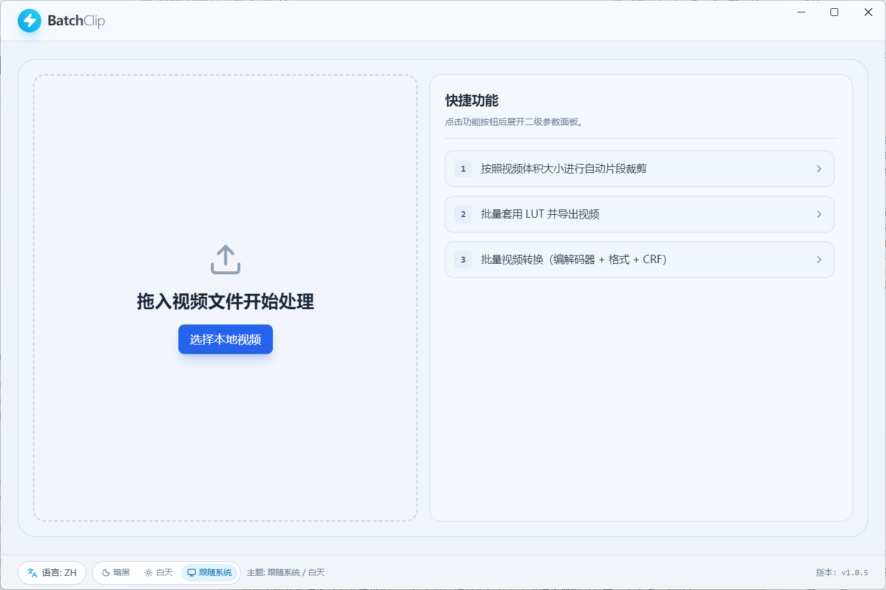
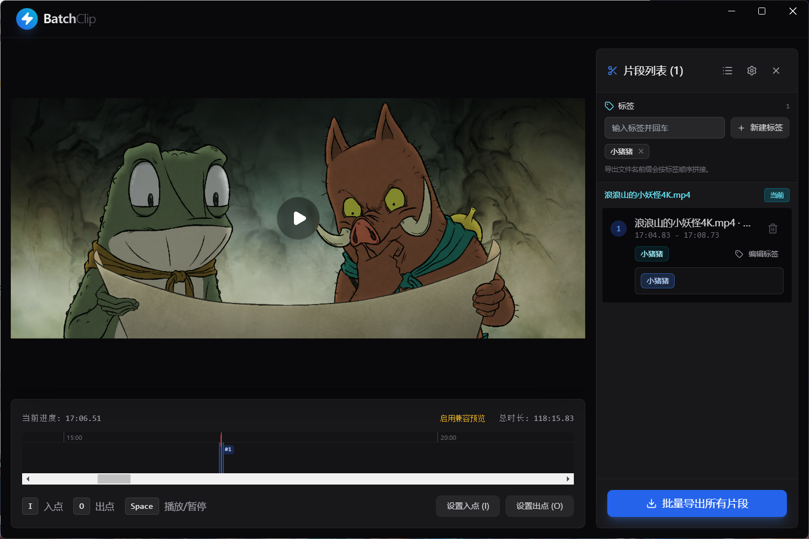

# BatchClip

[中文](./README.md) | [English](./README_EN.md)

BatchClip is a desktop video batch-processing tool built with Electron + React + TypeScript, designed for efficient export workflows with multiple videos, multiple segments, and optional LUT. It supports precise editing in the main workspace and quick batch operations on the landing screen (Split / LUT / Convert).

Current version: `v1.0.5`




## Recent Updates (2026-02-24)

- Added global status bar interactions: switch `ZH/EN` and theme (Dark / Light / Follow System) directly from the bottom bar on the landing screen, with current version display.
- Added a third quick action: batch video conversion (container format + video encoder + audio encoder + CRF).
- Batch conversion now supports built-in presets (Maximum Compatibility / Visually Lossless Compression) and custom presets (save / rename / delete).
- Added auto-compatibility correction for conversion tasks: incompatible format/encoder combinations are automatically adjusted to valid ones with a summary notice.

## Feature Overview

### Main Features (Editing Workspace)
- Video queue management: import multiple videos at once and switch the current editing target in the queue.
- Segment trimming: mark In/Out points with `I` / `O` shortcuts and manage multiple segments in batch.
- Tag system: manage a tag library and bind tags to segments; exported filenames can include tag prefixes.
- LUT preview and export: import `.cube` files, toggle LUT preview on/off, and adjust strength (0%-100%).
- Batch segment export: export all segments in the queue with one click.
- Full LUT export: apply LUT directly to all videos in the queue and export without segmenting.
- Global status bar: quickly switch `ZH/EN`, theme preference (Dark / Light / Follow System), and view current version.

### Quick Actions (Landing Screen)
- Auto split by target size:
  - Select one source video, set target size (MB), and export consecutive segments based on that size.
  - Keeps source resolution and stream by using no re-encoding (`-c copy`); the final segment may be smaller than the target size.
- Batch apply LUT and export:
  - Select multiple videos, choose one LUT and intensity, then export directly.
  - Includes real-time LUT preview on the landing screen (preview toggle, video switching, progress slider).
- Batch video conversion:
  - Select multiple videos and apply unified output container format, video/audio encoders, and CRF quality settings.
  - Includes built-in presets (Maximum Compatibility, Visually Lossless Compression) and custom preset management (save, rename, delete).
  - Automatically adjusts incompatible container/codec combinations and summarizes the adjustments after tasks finish.
  - Includes a parameter help dialog (format and encoder cards) for quicker onboarding.
  - Supports two performance strategies: "Auto GPU-first + CPU fallback" and "CPU-only".

## Batch Conversion Support Matrix

| Output Container | Video Encoder | Audio Encoder |
| --- | --- | --- |
| `mp4` | `h264` / `hevc` / `av1` | `aac` |
| `mkv` | `h264` / `hevc` / `vp9` / `av1` | `aac` / `opus` / `copy` |
| `webm` | `vp9` / `av1` | `opus` |
| `mov` | `h264` / `hevc` | `aac` |

Note: if an incompatible combination is selected, the app auto-corrects it to a supported one and reports the adjustment in the result summary.

## GPU and Fallback Strategy

- On Windows, export first tries `h264_nvenc` / `h264_qsv` / `h264_amf`, then automatically falls back to `libx264` if needed.
- On macOS, export first tries `h264_videotoolbox`, then automatically falls back to `libx264` if needed.
- Quick batch conversion supports automatic thread tuning and hardware-first encoding attempts based on the selected encoder, with seamless software fallback.
- The preview pipeline includes a compatibility mode (auto or manual switching when needed) to improve playback usability across different source encodings.

Note: seeing "GPU encoding failed, fallback applied" logs in development mode is expected behavior and does not affect successful final export.

## Install and Development

### Requirements
- Node.js 18+
- npm

### Install dependencies
```bash
npm install
```

### Local development
```bash
npm run dev
```

### Lint
```bash
npm run lint
```

## Build

### Windows
```bash
npm run build
# or
npm run build:win
```

If you run into Windows symlink permission issues, use:
```bash
npm run build:win:ps1
```

### macOS
```bash
npm run build:mac
```

### Try building both Win + mac
```bash
npm run build:all
```

## Usage Workflow

1. For precise editing scenarios, drag a video onto the landing screen or click to select a file to enter the main editing workspace.
2. For quick batch scenarios, use the right-side quick actions directly:
   - Auto split by target size
   - Batch LUT export (with real-time preview)
   - Batch video conversion (with presets)
3. In the main editing workspace for precise editing:
   - Mark segments with `I` / `O`
   - Manage tags
   - Exported filenames include tags for easier asset distinction
   - Batch export segments or run full LUT export
   - Switch active videos from the video list for preview
   - Optionally set fixed segment duration in preferences: after pressing `I`, `O` can be auto-controlled for fast fixed-length clipping
4. The bottom status bar lets you switch language and theme at any time; settings are persisted locally.

## Export Naming Rules

- Main segment export: `<tag_prefix_><original_video_name>_clip_01.mov`
- Quick split by size: `<original_video_name>_clip01.<source_ext>`
- Full LUT export: `<original_video_name>_lut.mov`
- Quick batch conversion: `<original_video_name>_convert.<target_ext>`
- Duplicate names are auto-suffixed to avoid overwriting.

## Project Structure (Current)

```text
electron/
  main.ts                     # Electron main process + IPC + FFmpeg orchestration
  preload.ts                  # Secure bridge

src/
  App.tsx                     # Composition layer: state orchestration and page assembly
  main.tsx                    # Frontend entry

  components/
    VideoPlayer.tsx
    Timeline.tsx
    quick-actions/
      QuickSplitBySizeFeature.tsx
      QuickLutBatchFeature.tsx
      QuickConvertBatchFeature.tsx

  features/
    main/
      types.ts
      hooks/
        useMainSettings.ts
      components/
        AppHeader.tsx
        MainLandingWorkspace.tsx
        MainEditorWorkspace.tsx
        SegmentList.tsx
        SettingsModal.tsx
        QueueModal.tsx
        ProgressOverlays.tsx
        GlobalStatusBar.tsx
        LutFullExportConfirmModal.tsx

    quick-actions/
      types.ts
      hooks/
        useQuickSplitBySize.ts
        useQuickLutBatch.ts
        useQuickConvertBatch.ts

  i18n/
    translations.ts           # Chinese and English text resources

  lib/
    video.ts                  # Video file and path utilities

public/                       # Static assets
docs/                         # Documentation assets (screenshots, etc.)
```

## License

MIT
